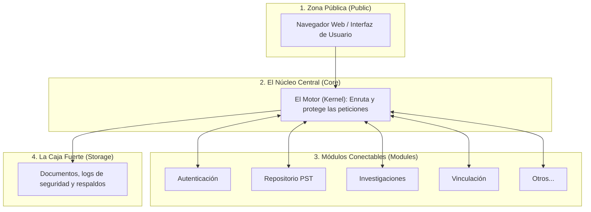

# Resumen Ejecutivo: Sistema de Gestión Universitaria y Vinculación (sistema_pnfi / proyect_CIIDI)

Este documento presenta una descripción general, no técnica, del sistema. Su objetivo es explicar de forma sencilla el propósito de la plataforma, qué funciones ofrece y cómo está estructurada internamente.

---

## 1. ¿Qué es este sistema? (El Propósito General)

Es una **plataforma web integral de gestión e innovación universitaria**. Su objetivo principal es centralizar, organizar y potenciar el trabajo académico y su relación con el entorno social y empresarial. 

A diferencia de los sistemas tradicionales, este no solo almacena información, sino que conecta activamente a tres actores clave:
1. **Estudiantes:** Encuentran problemas reales para resolver y exponen sus proyectos.
2. **Profesores e Investigadores:** Gestionan investigaciones, publican artículos científicos y guían proyectos.
3. **Empresas e Instituciones Externas:** Plantean problemas o necesidades técnicas para que la universidad les ayude a resolverlos.

Además, el sistema incluye tecnologías avanzadas de **Inteligencia Artificial (IA)** para buscar información de forma inteligente, predecir tendencias de desarrollo y responder dudas a través de un asistente virtual (chatbot) local.

---

## 2. ¿Qué puede hacer el sistema? (Módulos Funcionales)

El sistema se divide en **8 áreas de trabajo (módulos)**, las cuales actúan de forma independiente pero coordinada:

| Módulo | Nombre | ¿Para qué sirve? (En palabras sencillas) |
| :--- | :--- | :--- |
| 🔑 | **Autenticación y Seguridad** | Es la puerta de entrada. Controla quién entra al sistema (estudiantes, profesores, administradores) y qué permisos tiene cada uno. También gestiona la recuperación de contraseñas de manera segura. |
| 🔍 | **Repositorio PST (Proyectos)** | El archivo digital de los Proyectos Socio-Tecnológicos (PST). Cuenta con una barra de búsqueda inteligente (potenciada por IA) y pantallas gráficas que estiman qué tipo de proyectos se necesitarán en el futuro según los datos históricos. |
| 🧪 | **Investigaciones (I+D)** | Una cartelera digital donde se publican los proyectos de investigación científica de la universidad y se permite la postulación de estudiantes e investigadores interesados en participar. |
| 📖 | **Revista Digital (Artículos)** | Una biblioteca virtual donde se publican y leen artículos científicos destacados en un formato atractivo y ordenado. |
| 🏢 | **Vinculación Empresarial** | El puente con el sector productivo. Permite a empresas externas enviar solicitudes detallando problemas técnicos que necesitan resolver (ej. mejorar un proceso productivo), para que la universidad los asigne como proyectos de grado. |
| 🎓 | **Cartelera de Cursos** | Espacio para promocionar y gestionar la oferta de cursos de formación y talleres adicionales que ofrece la universidad. |
| 💬 | **Foro y Chatbot** | Un foro de discusión donde los usuarios pueden debatir y un asistente virtual inteligente (Chatbot) que responde preguntas en tiempo real utilizando un modelo de lenguaje que corre dentro del propio servidor de la universidad (garantizando privacidad). |
| 👑 | **Super Administrador** | El panel de control central. Permite encender o apagar módulos enteros, ver informes del uso del sistema y revisar el registro de errores para mantenimiento. |

---

## 3. ¿Cómo está construido? (La Arquitectura del Sistema)

Para explicar cómo está organizado el código sin usar términos informáticos complejos, podemos usar la metáfora de un **Chasis de Automóvil Moderno**:

### A. La Zona Pública (`public`)
Es la "carrocería" y los "controles del conductor". Representa todo lo que el usuario final ve e interactúa en su pantalla (los botones, los textos, los formularios, los colores y los archivos visuales).

### B. El Núcleo Central o Motor (`core`)
Es el **motor y la computadora de a bordo** (técnicamente llamado *Microkernel*). No realiza tareas específicas como "iniciar sesión" o "buscar un proyecto", pero se encarga de:
- Recibir las órdenes del usuario.
- Verificar que el usuario tenga permiso para lo que intenta hacer (seguridad).
- Dirigir la solicitud al módulo correcto.
- Conectarse de forma segura a la base de datos central.

### C. Los Módulos Conectables (`modules`)
Son como los **accesorios modulares** del vehículo (el aire acondicionado, la radio, los sensores de retroceso). Cada módulo hace una sola cosa bien y está separado de los demás.
- **¿Cuál es el beneficio?** Si la radio (ej. el módulo de cursos) falla, el motor sigue funcionando perfectamente y el auto puede seguir andando. Además, si en el futuro se quiere añadir un módulo nuevo (ej. control de notas), simplemente se "enchufa" al núcleo central sin tener que reescribir todo el sistema desde cero.

### D. La Caja Fuerte o Almacén (`storage`)
Es la **guantera bloqueada o maleta de seguridad**. Aquí se guardan los archivos pesados (como los PDFs de los proyectos), las copias de seguridad de las empresas y los registros de quién ha entrado al sistema. Esta zona está especialmente protegida para que nadie desde internet pueda acceder a ella directamente.

---

## 4. Resumen de Beneficios para la Institución

1. **Flexibilidad total (Modularidad):** Crece a medida que la universidad lo necesite. Los nuevos módulos se añaden como piezas de Lego.
2. **Seguridad robusta:** El núcleo central valida cada paso que da el usuario antes de permitirle ver o modificar información.
3. **Privacidad de la Información:** Las herramientas de Inteligencia Artificial (como el Chatbot) se procesan dentro de los servidores propios, evitando compartir datos confidenciales con servicios externos en la nube.
4. **Vínculo Universidad-Sociedad:** Rompe la barrera entre la teoría universitaria y la práctica profesional al digitalizar e integrar las problemáticas de las empresas reales con el currículo de los estudiantes.
